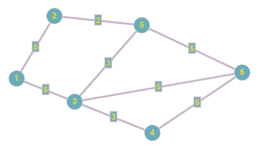
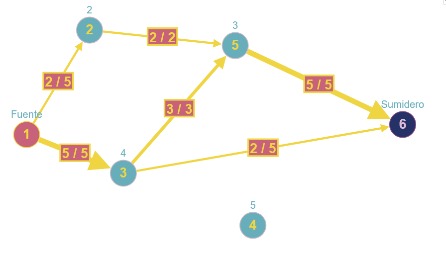

# Resolución

## PROBLEMA 2 - Redes de flujo

1.  **Análisis:**
    a.  Identificar supuestos, condiciones, limitaciones y/o premisas bajo los cuales funcionará el algoritmo desarrollado.

    - El grafo original es no dirigido. Se 
    recibe modelado como una lista de aristas
    con su capacidad. Ver archivo 
     grafico.csv para un
    ejemplo del enunciado.
    - Asumimos que no hay repeticiones de aristas en el input, es decir,
    la no dirección es implícita.
    - Se modelará como un grafo dirigido 
    agregando aristas en ambas direcciones.
    - Las capacidades son simétricas en cada
    arista.
    - 1 actuará de fuente y es única.
    - 10 actuará de sumidero y es único.
    - Las aristas que salen de la fuente solo permiten flujo saliente.
    - Las conexiones que llegan al nodo 10,
    es decir, el sumidero, no son bidireccionales.
    - La información que entra en un nodo es igual
    a la información que sale.
    - Las capacidades son números enteros positivos.

2.  **Diseño:**
    a.  Explicación en prosa de cómo se adaptan los datos de entrada a una red de flujo, y de cómo se debe interpretar la salida del algoritmo de Ford-Fulkerson para resolver este problema. Se recomienda incluir diagramas de apoyo.

    La capacidad de memoria en las aristas será la
    capacidad de los enlaces entre los nodos.
    
    Reemplazaremos cada arista no dirigida, por dos aristas, una en un sentido y otra en el opuesto.
    
    Aplicamos Ford-Fulkerson y nos dará el flujo
    máximo del grafo. En el grafo de flujos 
    que devuelva Ford-Fulkerson, habrán 
    aristas cuya recíproca
    tenga la misma carga pero en sentido opuesto.
    Estas aristas, con flujo neto cero,
    deberán ser las que se omiten
    de la solución final ya que no se usan
    para obtener la red con 
    la menor cantidad de enlaces.

    b.  Incluir un Pseudocódigo del algoritmo a desarrollar (asumir que ya se cuenta con un algoritmo que resuelve Redes de Flujo).
    
    def obtener_complemento(flujos, v):
        # asumo flujos diccionario de diccionarios
        # o lista de adyacencias
        v_i, v_j, c = v
        u_c = 0
        si v_j en flujos y v_i en flujos[v_j]:
            u_c = flujos[v_j][v_i] # si no existe es 0
        u = (v_j, v_i, u_c)
        devolver u

    def resolver(V):
            
        flujo_maximo, flujos = resolver_red(V)

        si flujo_maximo < 10:
            devolver [] # indicando que el problema no tiene solución
        
        sea solucion un set vacío
        sea aristas_procesadas un set vacío

        Para cada v de flujos:
            v_i, v_j, c_v = v
            u = obtener_complemento(flujos, v)

            si (v_i, v_j) no está en aristas_procesadas y (v_j, v_i) no está en aristas_procesadas:
                u_i, u_j, c_u = u
                flujo_neto = c_v - c_u
                si flujo_neto != 0:
                    si flujo_neto > 0:
                        nueva_v = (v_i, v_j, flujo_neto)
                        solucion.agregar(nueva_v)
                        aristas_procesadas.agregar((v_i, v_j))
                    sino:
                        nueva_u = (u_i, u_j, -flujo_neto)
                        solucion.agregar(nueva_u)
                        aristas_procesadas.agregar((u_i, u_j))
        
        devolver solucion

    Sea V la lista de aristas del grafo no dirigido

    v_dirigida = {}
    por cada (v_i, v_j, c) en V:
        # guardo la arista actual como adyacencia
        si v_i no en v_dirigida:
            v_dirigida[v_i] = {}
        v_dirigida[v_i][v_j] = c
        # Agregar arista inversa v_j → v_i
        # (excepto si involucra fuente/sumidero)
        si v_i != 1 y v_j != 10:
            # guardo al recíproca como adyacencia
            si v_j no en v_dirigida:
                v_dirigida[v_j] = {}
            v_dirigida[v_j][v_i] = c

    resolver(v_dirigida)

    c.  Detallar las estructuras de datos utilizadas. Justificar su elección.

    Para el grafo, usaremos una lista de adyacencias, donde
    cada elemento de la lista representará un
    nodo y el valor que almacena será una lista
    de tuplas donde la primera posición
    indicará el nodo destino y el segundo la
    capacidad de la arista.
    Esta representación se elige porque, 
    en el grafo propuesto, cada nodo tiene 
    como mucho 4 aristas,
    razón por la cual, una matriz sería poco
    eficiente para representar este problema.

    Para el grafo de flujos, podríamos usar una
    lista de adyacencias o un dicionario de
    diccionarios. En el primer nivel
    la clave sería 
    el nodo de origen y en el segundo, el nodo
    de destino, el valor sería el flujo.
    Esto permitiría buscar la arista recíproca
    de manera muy rápida.

    Adicionalmente, usamos un set 'aristas_procesadas' 
    para evitar procesar dos veces la misma arista del 
    grafo de flujos, ya que cada arista original genera
    dos dirigidas (u→v y v→u).

    Para la solución armamos un set de tuplas
    para no preocuparnos por procesar dos
    veces una arista

3.  **Seguimiento:** 
Mostrar un ejemplo de seguimiento con un set de datos reducido


```
grafo = {
    1: [(2, 5), (3, 5)],  # Nodo 1 conecta con 2 (cap. 5) y 3 (cap. 5)
    2: [(1, 5), (5, 2)],  # Nodo 2 conecta con 1 (cap. 5) y 5 (cap. 2)
    3: [(1, 5), (4, 3), (5, 3), (6, 5)],  # Nodo 3 conecta con 1, 4, 5 y 6
    4: [(3, 3), (6, 5)],  # Nodo 4 conecta con 3 y 6
    5: [(2, 2), (3, 3), (6, 5)]  # Nodo 5 conecta con 2, 3 y 6
    6: [(3, 5), (4, 5), (5, 5)]  # Nodo 6 conecta con 3, 4 y 5
}
```

Ya tenemos el grafo expresado como una lista de adyacencias
se lo pasamos al algoritmo que resuelva la red.



Nos devolvió que el flujo máximo es 7.
Si el archivo fuese de 10 MB, entonces no
tendríamos solución, pero supongamos que
es de 7.
En este caso lo que haremos es evaluar cada
arista del flujo.
Cuya representación será algo así:

```
flujos = {
    1: [(2, 2), (3, 5)],  # Nodo 1 conecta con 2 (con flujo 2) y 3 (con flujo 5)
    2: [(5, 2)],  # Nodo 2 conecta con 5 (con flujo 2)
    3: [(5, 3), (2, 5)],  # Nodo 3 conecta con 5 y 2
    5: [(6, 5)]  # Nodo 5 conecta con 6
}
```

Nótese que en esta representación no figuran
las aristas que tienen flujo 0 ni las
recíprocas.

Con lo cual, nos queda claro que la solución
es la iteración entre las aristas de la lista
de flujos:

```
[(1, 2), (1, 3), (2, 5), (3, 4), (3, 5)
(4, 6), (5, 6)] 
```

4.  **Complejidad:** Realizar un análisis de la complejidad temporal a partir del pseudocódigo

**Conversión a grafo dirigido:**
    
En el primer bucle, iteramos sobre cada arista
del grafo original para agregar las aristas
inversas. Esto tiene complejidad O(E), donde
E es el número de aristas originales.

**Ejecución de Ford-Fulkerson:**

La llamada a resolver_red(V) ejecuta el
algoritmo de Ford-Fulkerson. Asumiendo que
se usa la implementación de Edmonds-Karp, 
que usa BFS para encontrar caminos de
aumento, la complejidad es O(V × E²). Siendo V
el número de nodos.

**Verificación de factibilidad:**

La comparación del flujo máximo con 10 es
una operación constante O(1).

**Procesamiento del grafo de flujos:**

El bucle principal itera sobre cada arista
del grafo de flujos. En el peor caso, todas
las aristas del grafo dirigido tienen flujo,
con lo cual serían E iteraciones.

Dentro del bucle, la función obtener_complemento()
tiene complejidad O(1) si usamos un diccionario
de diccionarios para representar los flujos,
ya que el acceso es directo mediante las claves.
Si usáramos una lista de adyacencias, sería
O(E) asumiento como peor caso que todos los
nodos están conectados con todos.

Las verificaciones de pertenencia en los sets
aristas_procesadas y solucion son O(1) en
promedio, así como las inserciones.

Con lo cual, este procesamiento tiene
complejidad O(E) asumiendo diccionario de
como hicimos en el pseudocódigo,
u O(E × V) con lista de adyacencias, que
es como se suele representar este tipo de
grafos.

**Complejidad total:**

Sumando todas las partes:
O(E) + O(V × E²) + O(1) + O(E) = O(V × E²)

La complejidad está dominada por la ejecución
de Ford-Fulkerson con Edmonds-Karp.

Según lo visto en clase,
si se usara Ford-Fulkerson con DFS
y capacidades enteras, la complejidad
sería O(E × f), donde
f es el flujo máximo (10 MB en este caso),
resultando en O(15 × 10) = O(150).

5.  **Solución:**
    a.  Opción 1: resolver manualmente, indicando paso a paso cómo el algoritmo planteado encuentra los caminos de aumento y construye la red residual

    b.  Opción 2: Desarrollar un programa que resuelva el modelo usando Python y una biblioteca de Redes de Flujo (propia o de terceros). Incluir todos los archivos necesarios para la ejecución. Incluir un archivo con el resultado obtenido.

    Resuelto en ejercicio_2.py
6.  **Informe de Resultados:**
    a.  Redactar un informe de la solución, indicando cómo se debe fragmentar y distribuir el archivo

    El flujo máximo desde el nodo 1 al nodo 10 es: 10
    Flujos por arista:
    1 -> 2: 5
    1 -> 3: 5
    2 -> 6: 1
    2 -> 5: 2
    2 -> 9: 2
    3 -> 4: 3
    3 -> 7: 2
    6 -> 9: 1
    5 -> 7: 2
    9 -> 10: 3
    4 -> 8: 3
    7 -> 10: 4
    8 -> 10: 3

    b.  Para resolver este problema, ¿es mejor utilizar Programación Lineal o Redes de Flujo? Justificar el criterio utilizado para comparar las dos técnicas
