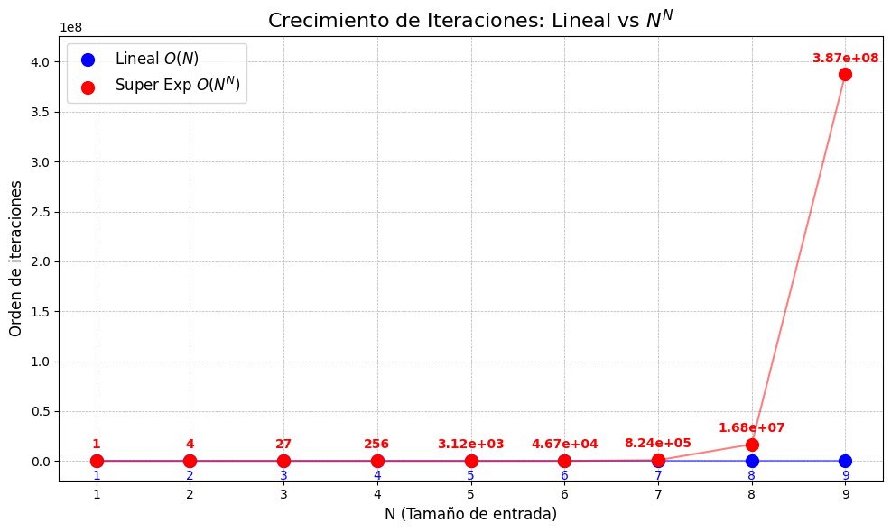

## 1

### 1.A

Para que el algoritmo este bien definido, debemos establecer los siguientes supuesto : 
1. Atomicidad : Los objetos a ubicar son indivisibles. Es decir, no se pueden partir para poner una parte en un recipiente y otra parte en otro.
2. Homogeneidad : Todos los recipientes son identicos y tienen una capacidad *C* == 1
3. Validez de la entrada : Todos los objetos recibidos en la entrada ocupan una capacidad "S" entre 0 y 1.


### 1.B

El espacio de soluciones posibles es inmensamente grande, ya que la cantidad de formas de agrupar n objetos crece de manera combinatoria a medida que aumenta el tamaño de entrada.

Si tenemos N objetos, y en el peor de los casos deberiamos usar N recipientes, entonces la combinacion es : 

Total: $n \times n \times ... = n^n$

Esta complejidad computacional hace poco practico buscar la solución exacta, lo que justifica la necesidad de utilizar un algoritmo de aproximación eficiente.

## 2
### 2.A
El problema planteado en esta consigna es un problema conocido en el mundo de la computación. Para resolverlo vamos a aplicar la tecnica "next-fit", una tecnica simple y lineal.

Se van insertando los elementos en los contenedores en orden, cuando este contenedor se llena pasamos al siguiente y asi susebiamente.

Podemos plantear el pseudo-codigo como : 

```
next_fit(lista_objetos):
    // Si no hay objetos, se necesitan 0 recipientes
    SI lista_objetos ESTÁ VACÍA:
      RETORNAR 0

    // Inicializamos el primer recipiente
    contenedores_usados = 1
    espacio_disponible = 1 //Capacidad inicial de los contenedores.

    PARA CADA objeto EN lista_objetos:
        
        SI objeto <= espacio_disponible ENTONCES:
            espacio_disponible -= objeto
        
        SINO:
            // El objeto no entra, pasamos al siguiente recipiente
            contenedores_usados += 1 
            // El nuevo recipiente contiene el objeto actual
            espacio_disponible = capacidad_max - objeto
        
        FIN SI

    FIN PARA

    RETORNAR contenedores_usados
```
### 2.B


La base de la desmotración reside en la imposibilidad del algoritmo de dejar dos recipientos consecutivos con "la mitad o menos" de ocupación.

Si tenes 2 recipientos consecutivos n y n+1:
* Si el algoritmo tuvo que utilizar el recipiente n+1, significa que el elemento no cabia en N.
* Si N hubiera estado ocupado solo hasta la mitad, la unica razon para utilizar N+1 es que el nuevo elemento sea mayor a 0.5
* Por lo tanto, es imposible tener 2 recipientes consecutivos con una suma de capacidad desperdiciada > 1
* Llevando este ultimo paso a el total de elementos, podemos decir con seguridad que la cantidad de contenedores utilizada es menor a el doble del optimo.

Se puede encontrar una demostración formal en  Vazirani, Vijay V. (2003), Approximation Algorithms, Berlin: Springer.

### 2.C

La unica estructura de datos utilizada es un arreglo. Este es necesario para poder recibir los N contenedors como parametro.

### 3
Suponinendo una entrada de :
[0.6, 0.5, 0.3, 0.7, 0.4]

| Paso | Objeto ($s_i$) | Estado Previo (Espacio Libre) | Acción | Resultado |
| :---: | :---: | :--- | :--- | :--- |
| **1** | 0.6 | N/A (Inicio) | Se abre el **Recipiente 1**. | **Recipiente 1**: `[0.6]` <br> *(Libre: 0.4)* |
| **2** | 0.5 | 0.4 | El objeto (0.5) **NO entra**. <br> Se cierra Rec. 1 y abre **Recipiente 2**. | **Recipiente 2**: `[0.5]` <br> *(Libre: 0.5)* |
| **3** | 0.3 | 0.5 | El objeto (0.3) **SÍ entra** en Rec. 2. | **Recipiente 2**: `[0.5, 0.3]` <br> *(Libre: 0.2)* |
| **4** | 0.7 | 0.2 | El objeto (0.7) **NO entra**. <br> Se cierra Rec. 2 y abre **Recipiente 3**. | **Recipiente 3**: `[0.7]` <br> *(Libre: 0.3)* |
| **5** | 0.4 | 0.3 | El objeto (0.4) **NO entra**. <br> Se cierra Rec. 3 y abre **Recipiente 4**. | **Recipiente 4**: `[0.4]` <br> *(Libre: 0.6)* |

Resultado : Se usaron 4 recipientes

### 4
Obtener la complejidad temporal es trivial, se trata de un loop para recorrer todo un array donde dentro de este loop se realizan operaciones de complejidad constante. 
Por lo tanto el algoritmo tiene una complejidad O(N).

Comparandolo con el tamaño de soluciones factibles (n^n), podemos ver la poca viabilidad temporal que tendria implementar una fuerza bruta : 


### 5 
Los sets de datos se generaron de manera aleatoria, esto es para poder tener un gran volumen y poder medir los tiempos de una manera más adecuada.

Los mismos se pueden encontrar en el codigo y se generan al momento de ejecutar las pruebas.

### 6

----
Referencias : 
* https://en.wikipedia.org/wiki/Bin_packing_problem
* https://www.geeksforgeeks.org/dsa/bin-packing-problem-minimize-number-of-used-bins/
* https://en.wikipedia.org/wiki/First-fit-decreasing_bin_packing
* https://en.wikipedia.org/wiki/Next-fit_bin_packing
* https://dspace.mit.edu/handle/1721.1/57819
* https://sites.cs.ucsb.edu/~suri/cs130b/BinPacking
